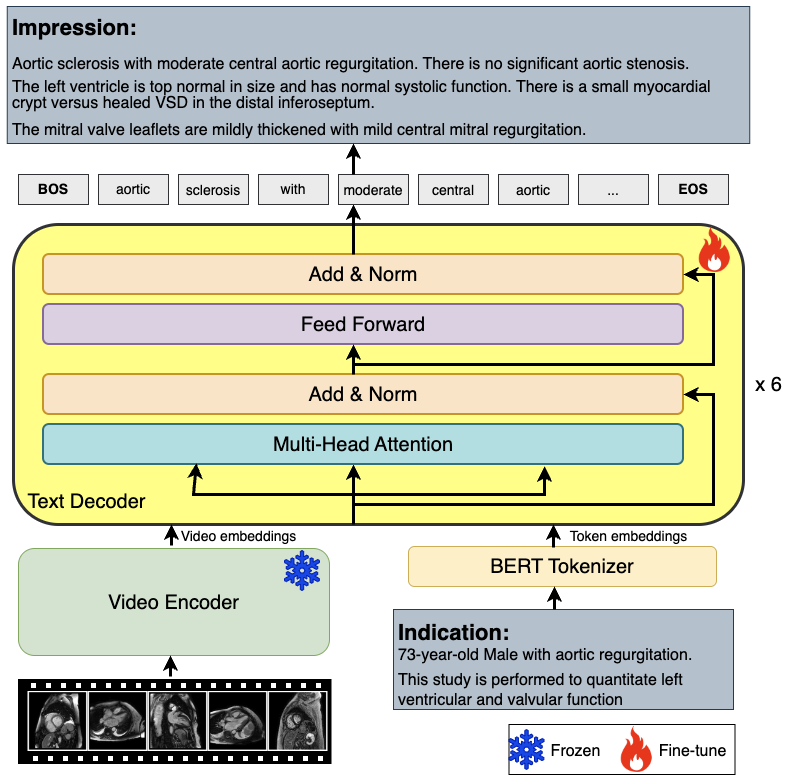
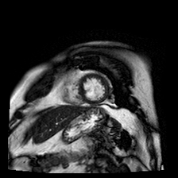

# Indication Driven Autoregressive Report Generation for Cardiac Magnetic Resonance Imaging

  

This project was accepted to ML4H 2024.

## CMR data
We used 64 Cardiac Magnetic Resonance (CMR) images to train the model. The following sequences were concatenated for model input:
* CINE Series: SAX-Apex (9 frames), SAX-Mid (9 frames), SAX-Basal (9 frames), LAX (9 frames), 2CH (9 frames), 3CH (9 frames), 4CH (9 frames)
* LGE Series: SAX (7 slices), LAX (1 slice), 2CH (1 slice), 3CH (1 slice), 4CH (1 slice)

  

## Training
To train the model, run the main.py file.

## Inference
Once training is complete, use inference.py to generate a report from CMR data.

## Acknowledgement
Part of the code is based on 
[transformers](https://github.com/huggingface/transformers),
[GIT](https://github.com/microsoft/GenerativeImage2Text),
[Frozen in time](https://github.com/m-bain/frozen-in-time),
